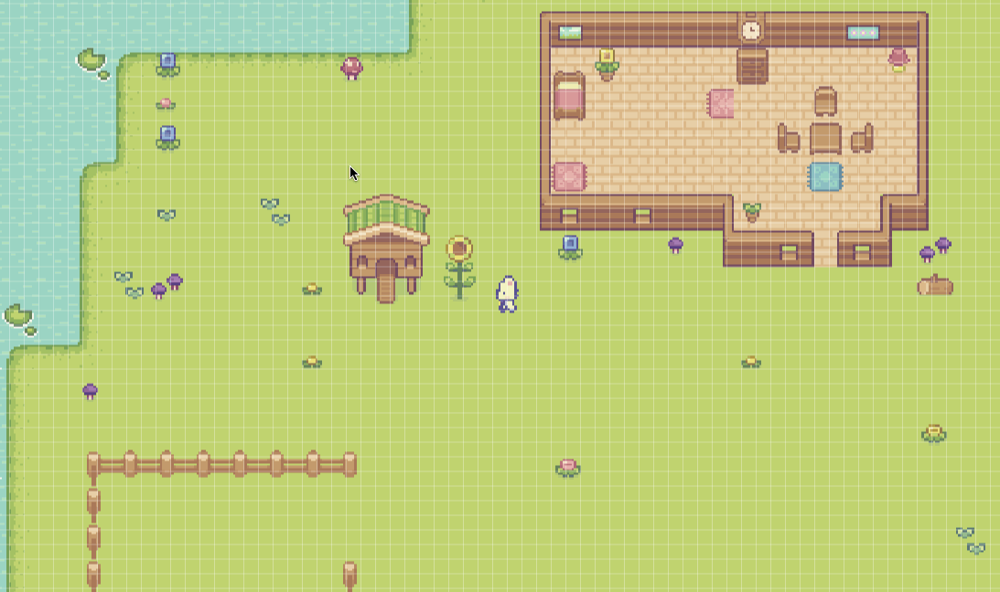

## 简介
在线预览： https://farmgame-zy.netlify.app

✨ 我的第一个从自己用素材绘图开始，从0到1制作的小游戏

 ✨ 巧妙地使用了React.js+Vite，Pixi.js引擎





---

## 一些开发中的笔记

### 保持像素图清晰

1. **CSS 层面**

```css
canvas {
  image-rendering: pixelated;       /* Chrome/Safari */
  image-rendering: crisp-edges;     /* Firefox */
}
```

2. **PixiJS Stage 配置**

```jsx
<Stage 
  options={{
    autoDensity: true,  // 自动处理设备像素比
    resolution: window.devicePixelRatio,  // 适配高DPI显示器
    antialias: false    // 关闭抗锯齿
  }}
>
```

3. **Texture 设置**

```javascript
// 创建纹理时
const texture = Texture.from(imageUrl);
texture.baseTexture.scaleMode = SCALE_MODES.NEAREST;  // 使用最近邻缩放
```

4. **Sprite 属性**

```jsx
<Sprite 
  texture={texture}
  width={32}      // 保持原始尺寸的整数倍
  height={32}     // 避免非整数缩放
/>
```

5. **资源制作**

- 使用 1:1 的像素比例制作原始图片
- 避免使用奇数尺寸
- 保持 2 的幂次方尺寸（16x16, 32x32 等）

这些方法配合使用，可以最大程度保持像素图的清晰度。


Sprite 和 Texture 的关系如下：

1. **基本关系**

```javascript
// Texture 是图片数据
const texture = Texture.from('path/to/image.png');

// Sprite 是显示对象，使用 Texture 来渲染
const sprite = new Sprite(texture);
```

2. **类比解释**

- Texture 就像是"照片"
- Sprite 就像是"相框"
- 一张照片(Texture)可以放在多个相框(Sprite)里
- 相框(Sprite)可以调整位置、大小、旋转等

3. **代码示例**

```jsx
// 多个 Sprite 共用一个 Texture
const rockTexture = Texture.from('rock.png');

<Sprite 
  texture={rockTexture}
  x={100}
  y={100}
/>

<Sprite 
  texture={rockTexture}  // 同一个 texture
  x={200}
  y={200}
  scale={2}  // 不同的显示属性
/>
```

4. **内存优化**

```javascript
// 好的做法：共用 texture
const sharedTexture = Texture.from('image.png');
const sprite1 = new Sprite(sharedTexture);
const sprite2 = new Sprite(sharedTexture);

// 不好的做法：重复加载
const sprite1 = new Sprite(Texture.from('image.png'));  // 新建 texture
const sprite2 = new Sprite(Texture.from('image.png'));  // 又新建 texture
```

5. **生命周期**

- Texture 通常在游戏加载时创建
- 可以被多个 Sprite 重复使用
- 应该在不需要时销毁以释放内存


### 移除监听器会在以下情况触发：

1. **组件卸载时**

```javascript
useEffect(() => {
  // 添加监听器
  window.addEventListener('resize', handleResize);

  // 返回的函数会在组件卸载时执行
  return () => window.removeEventListener('resize', handleResize);
}, []);
```

2. **路由切换时**

```javascript
// 当从这个页面切换到其他页面时
function GamePage() {
  useEffect(() => {
    window.addEventListener('resize', handleResize);
    // 路由切换时会执行清理
    return () => window.removeEventListener('resize', handleResize);
  }, []);
}
```

3. **条件渲染时**

```javascript
function Game() {
  const [isPlaying, setIsPlaying] = useState(true);

  return (
    <div>
      {isPlaying && <GameComponent />}  
      {/* 当 isPlaying 变为 false 时，GameComponent 卸载，触发清理 */}
    </div>
  );
}
```

4. **依赖项变化时**

```javascript
useEffect(() => {
  window.addEventListener('resize', handleResize);
  
  return () => window.removeEventListener('resize', handleResize);
}, [someValue]);  // 当 someValue 变化时，先执行清理，再重新添加
```

这种清理机制防止：

- 内存泄漏
- 重复监听
- 过时的事件处理

### 一个游戏有几个Stage？

1. **单 Stage 模式**

```jsx
function Game() {
  return (
    <Stage>
      <GameScene />  {/* 所有游戏内容在一个 Stage */}
    </Stage>
  );
}
```

2. **多 Stage 模式**

```jsx
function Game() {
  return (
    <>
      {/* 主游戏 Stage */}
      <Stage>
        <GameScene />
      </Stage>

      {/* UI Stage - 独立的UI层 */}
      <Stage>
        <UILayer />
      </Stage>

      {/* 小地图 Stage */}
      <Stage>
        <Minimap />
      </Stage>
    </>
  );
}
```

3. **常见用途**

```jsx
function Game() {
  return (
    <div>
      {/* 主游戏画面 */}
      <Stage width={1920} height={1080}>
        <GameWorld />
      </Stage>

      {/* 独立的 UI 层，避免与游戏世界混合 */}
      <Stage 
        width={1920} 
        height={1080}
        options={{ transparent: true }}  // 透明背景
      >
        <HUD />  {/* 抬头显示 */}
        <Inventory />  {/* 物品栏 */}
      </Stage>

      {/* 调试信息层 */}
      <Stage 
        width={300} 
        height={200}
        options={{ transparent: true }}
      >
        <DebugInfo />
      </Stage>
    </div>
  );
}
```

优点：

1. 更好的层次管理
2. 独立的渲染控制
3. 性能优化（可以只更新需要的层）
4. 更容易处理不同缩放和交互

### 抬头显示

HUD (Heads-Up Display，抬头显示) 是游戏中常见的界面元素，显示重要信息：

1. **常见 HUD 元素**

```jsx
function HUD() {
  return (
    <Container>
      {/* 生命值 */}
      <HealthBar value={100} maxValue={100} />
    
      {/* 体力值 */}
      <StaminaBar value={80} maxValue={100} />
    
      {/* 金钱/分数 */}
      <CoinCounter value={1000} />
    
      {/* 小地图 */}
      <Minimap />
    
      {/* 当前装备 */}
      <CurrentTool tool="axe" />
    
      {/* 时间/天气 */}
      <GameTime time="12:00" day={1} />
    </Container>
  );
}
```

2. **位置示例**

```
+------------------+
|生命值  体力值    |  <- 顶部信息
|金币: 1000       |
|                 |
|                 |
|                 |
|                 |
|          小地图  |  <- 右下角
|当前工具         |  <- 底部工具栏
+------------------+
```

3. **特点**

- 始终显示在游戏画面最上层
- 不受游戏世界缩放影响
- 显示实时游戏状态
- 帮助玩家快速获取信息

就像你的游戏中，可能需要显示：

- 当前工具
- 体力值
- 时间
- 物品栏等

### useCallback详解

`useCallback` 是一个用于性能优化的 Hook，主要用于缓存函数：

1. **基本用法**

```javascript
const MyComponent = () => {
  // 没有使用 useCallback
  const normalFunction = () => {
    console.log('每次渲染都会创建新函数');
  };

  // 使用 useCallback
  const memoizedFunction = useCallback(() => {
    console.log('只在依赖项改变时才创建新函数');
  }, []);  // 空数组表示没有依赖项
};
```

2. **带依赖项的例子**

```javascript
const Game = () => {
  const [score, setScore] = useState(0);
  
  // 依赖 score，score 改变时才会创建新函数
  const handleClick = useCallback(() => {
    setScore(score + 1);
  }, [score]);
};
```

3. **实际应用场景**

```javascript
// 在你的 Rock 组件中
const Rock = ({ id, position, onInteract }) => {
  const handleClick = useCallback((e) => {
    e.stopPropagation();
  
    if (!canInteract) return;
  
    const newHealth = health - 1;
    setHealth(newHealth);
  
    if (newHealth <= 0 && onInteract) {
      onInteract(id);  // 调用父组件传来的函数
    }
  }, [canInteract, health, id, onInteract]);  // 依赖项
};
```

4. **优化前后对比**

```javascript
// 优化前：每次渲染都创建新函数
const handleClick = () => {
  doSomething();
};

// 优化后：只在依赖项变化时创建新函数
const handleClick = useCallback(() => {
  doSomething();
}, [dependency]);
```

5. **使用场景**

- 传递给子组件的回调函数
- 作为其他 Hook 的依赖项
- 需要保持函数引用稳定的场合

需要我详细解释任何部分吗？
